# [eEDB-011] - Ingestão de Dados - Atividade 1

## Índice
- [\[eEDB-011\] - Ingestão de Dados - Atividade 1](#eedb-011---ingestão-de-dados---atividade-1)
  - [Índice](#índice)
  - [Membros](#membros)
  - [Ambiente](#ambiente)
  - [Descrição da Atividade](#descrição-da-atividade)
  - [Solução](#solução)
    - [Apache Hop](#apache-hop)
    - [Extract](#extract)
      - [Bancos](#bancos)
      - [Empregados](#empregados)
      - [Reclamações](#reclamações)
    - [Transform](#transform)
      - [1º join: Bancos e Empregados](#1º-join-bancos-e-empregados)
      - [2º join: Resultado do 1º join e Reclamações](#2º-join-resultado-do-1º-join-e-reclamações)
      - [Preview da dimensão final](#preview-da-dimensão-final)
    - [Load](#load)

## Membros
- Danilo de Souza Silva
- Matheus Pereira Nascimento
- Vanessa Zeni da Silva
- Willian Camargo Aires Maranhão

## Ambiente
- Apache Hop 2.14
- Postgres 17.5 (Docker Container)
- pgAdmin 9.6 (Docker Container)

## Descrição da Atividade
Atividade 1 – Ingestão e ETL com ferramenta visual
- Utilizar uma ferramenta visual para ingestão e tratamento de dados. Qualquer ferramenta visual pode ser utilizado, sendo algumas das sugestões:
  - Kettle (Pentaho Data Integration) – Apache Hop
  - Talend
  - Knime
  - Pode ser utilizado também laboratório em cloud fornecido pela programa na AWS com a ferramenta visual do Glue
- Realizar a ingestão de todas as base de dados em um banco de dados relacional open source. Pode ser utilizado qualquer banco de dado sendo algumas sugestões:
  - MySQL
  - Postgre
  - ClickHouse
- Gerar uma tabela final com os dados tratados e unidos.
  - O tratamento de dados deve ser realizado através da ferramenta de ETL

## Solução
Foi utilizada a ferramenta Apache Hop para realizar o ETL (Extract, Transform and Load) dos [dados](https://github.com/eEDB-Grupo-5/data_ingestion_1/tree/main/data) sugeridos, que contemplam uam lista de bancos, metricas dos empregados extraídos do Glassdor e raclamações relativas a estas instituições financeiras. Os dados foram disponibilizados em uma camada stage/raw para posterior disponibilização em outras camadas.

### Apache Hop
Desenho geral da solução no Apache Hop

### Extract
Extração de todos os dados contidos nos arquivos e ingestão em uma camada stage/raw.

#### Bancos
- Configuração do componente de ingestão do arquivo de Bancos.
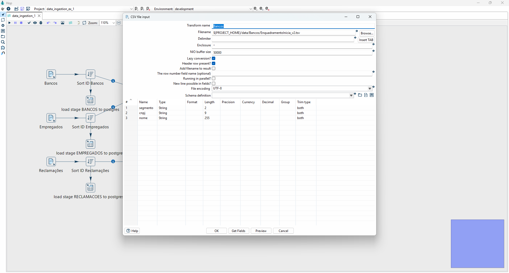

- Preview dos dados pré ingestão.
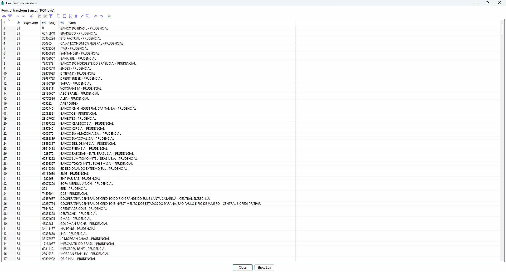

- Visualização dos dados ingeridos no Postgres (camada stage/raw).
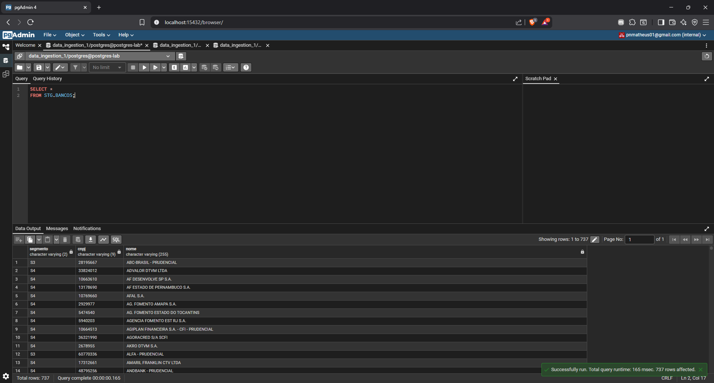

#### Empregados
- Configuração do componente de ingestão do arquivo de Empregados.
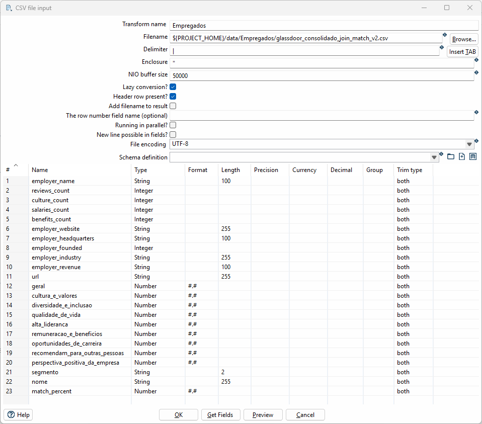

- Preview dos dados pré ingestão.
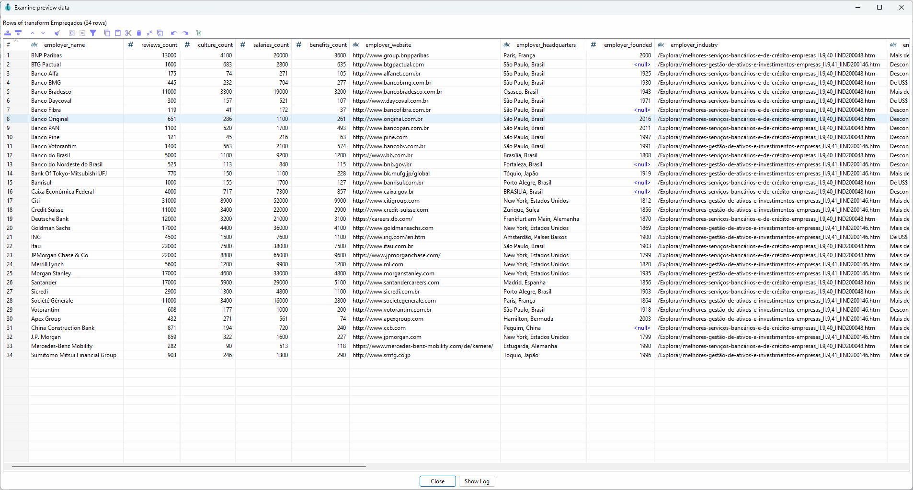

- Visualização dos dados ingeridos no Postgres (camada stage/raw).
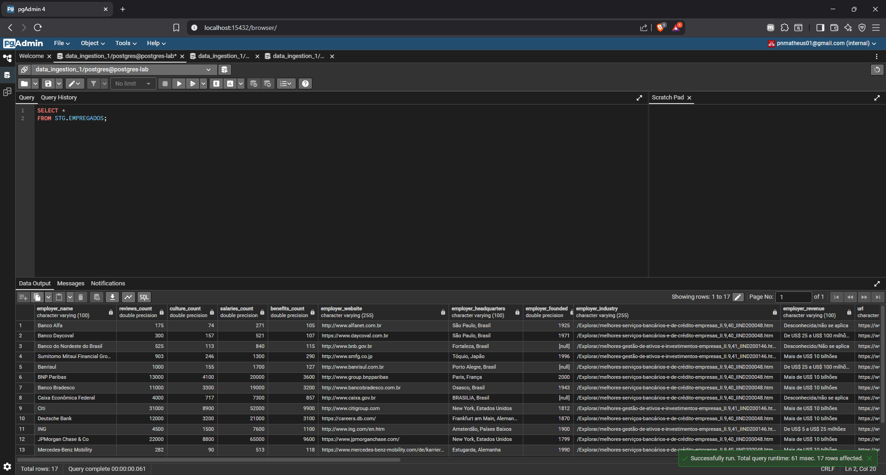

#### Reclamações
- Configuração do componente de ingestão do arquivo de Reclamações. Neste etapa foi utilizado um componente que faz a varredura em um diretório para realizar a ingestão dos múltiplos arquivos.
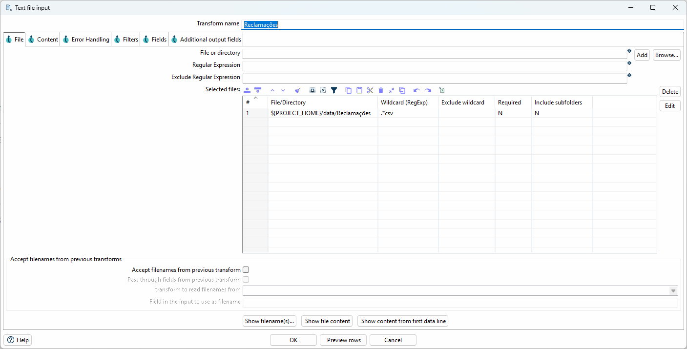

- Preview dos dados pré ingestão.
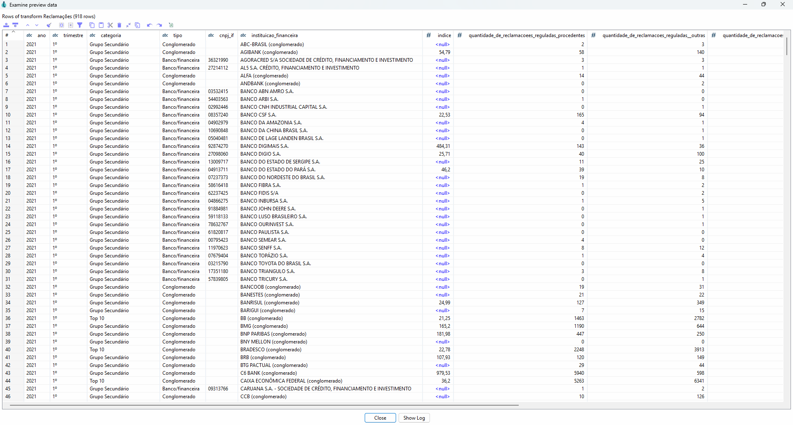

- Visualização dos dados ingeridos no Postgres (camada stage/raw).
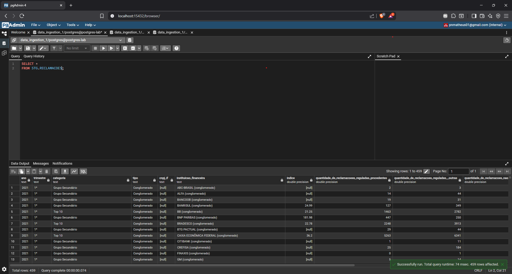

### Transform
Etapa de transformação dos dados, onde os dados foram ordenados pelas chaves que irão compor a operação de join entre as tabelas, e posteriormente a junção dos dados utilizado o componente de Merge Join.

#### 1º join: Bancos e Empregados
- Configuração do componente de Merge Join.
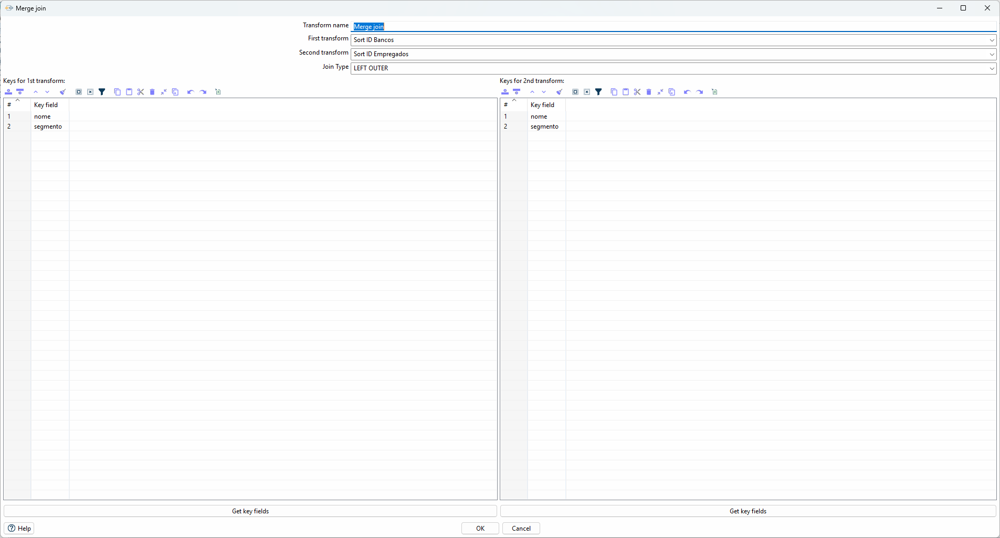

#### 2º join: Resultado do 1º join e Reclamações
- Configuração do componente de Merge Join.
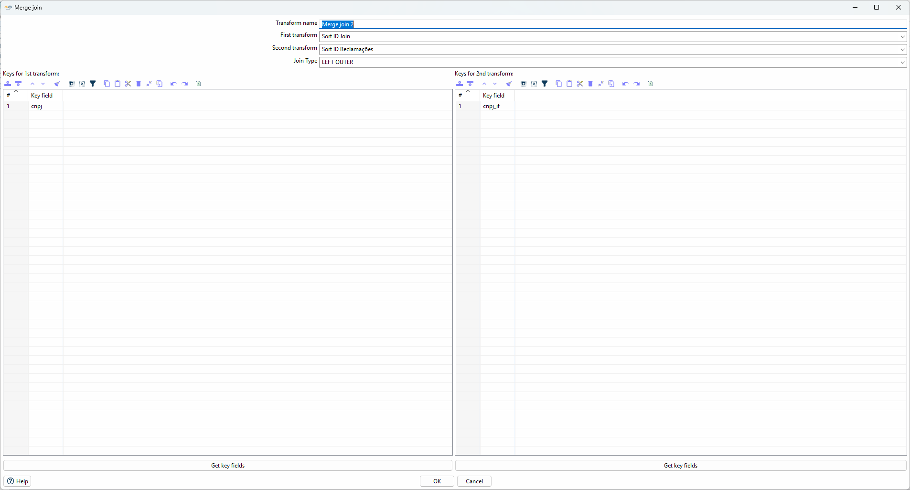

#### Preview da dimensão final
- Preview 1:
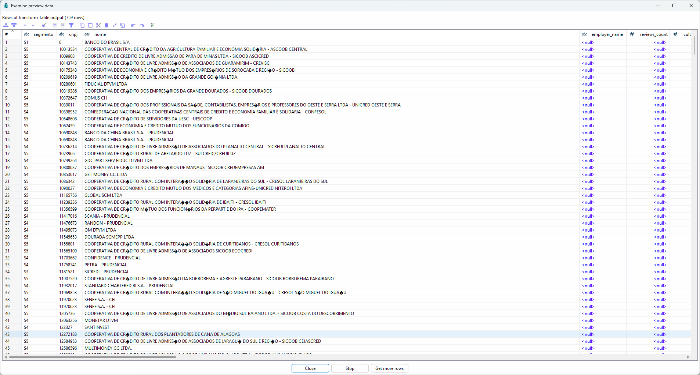
- Preview 2:
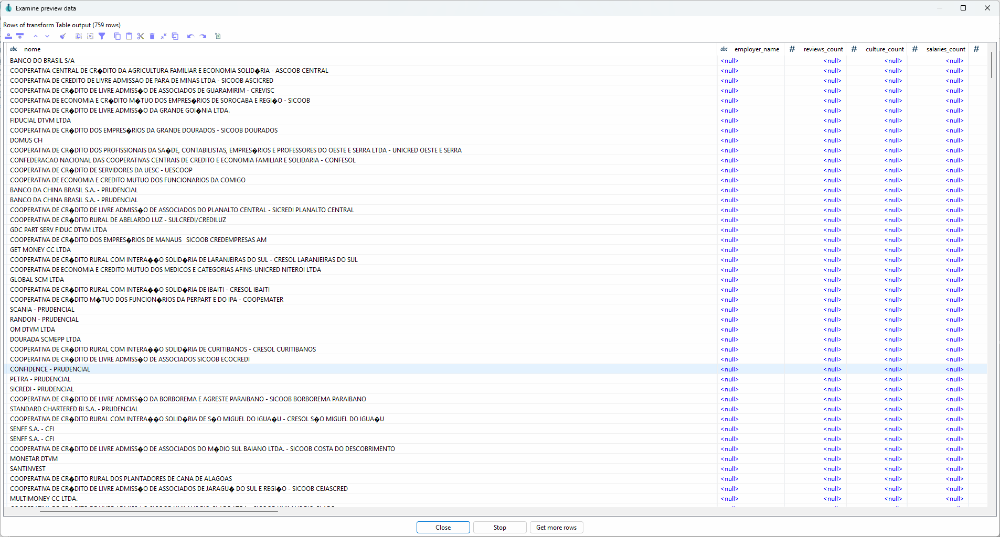
- Preview 3:
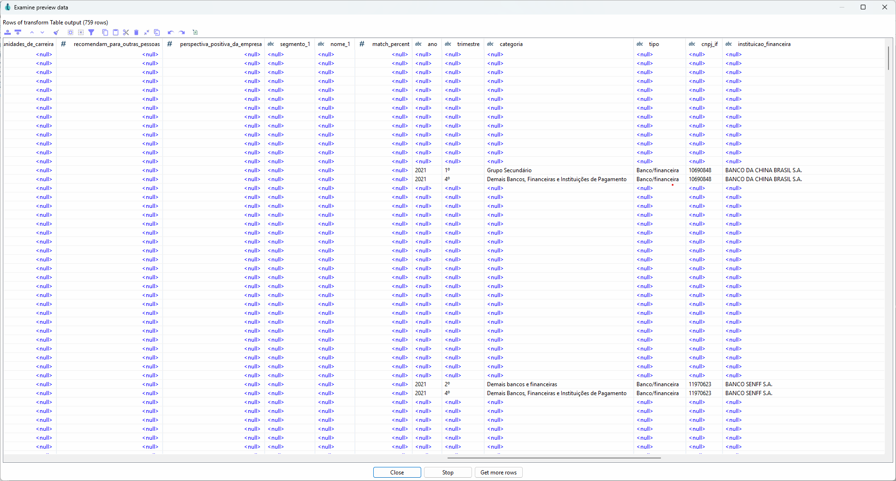

> Importante destacar que neste operador de join, há uma discrepância do resultado comparado a utilização de um banco relacional para relização do join.

### Load
Etapa final do processo que leva o resultado da transformação para um banco relacional, neste caso, o Postgres.
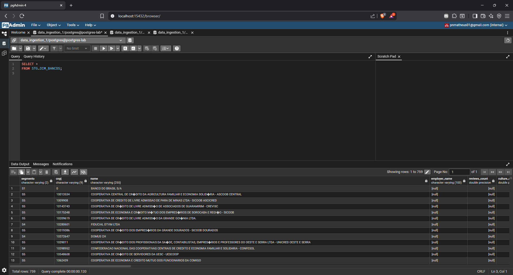
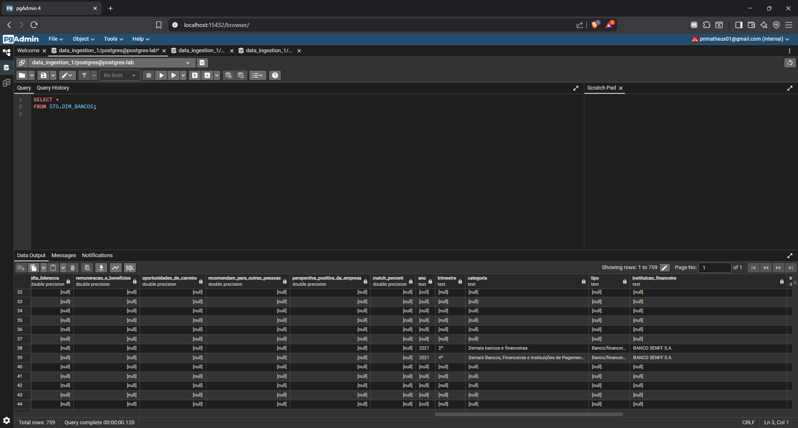