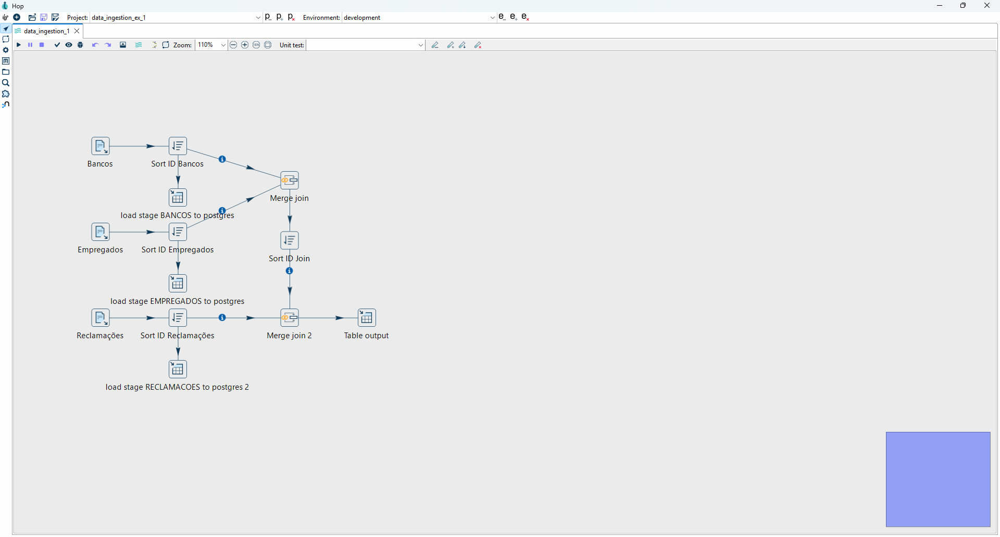

# [eEDB-011] - Ingestão de Dado - Atividade 1

## Índice
- [\[eEDB-011\] - Ingestão de Dado - Atividade 1](#eedb-011---ingestão-de-dado---atividade-1)
  - [Índice](#índice)
  - [Membros](#membros)
  - [Ambiente](#ambiente)
  - [Descrição da Atividade](#descrição-da-atividade)
  - [Solução](#solução)
    - [Apache Hop](#apache-hop)

## Membros
- Danilo de Souza Silva
- Matheus Pereira Nascimento
- Vanessa Zeni da Silva
- Willian Camargo Aires Maranhão

## Ambiente
- Apache Hop 2.14
- Postgres 17.5 (Docker Container)
- pgAdmin 9.6 (Docker Container)

## Descrição da Atividade
Atividade 1 – Ingestão e ETL com ferramenta visual
- Utilizar uma ferramenta visual para ingestão e tratamento de dados. Qualquer ferramenta visual pode ser utilizado, sendo algumas das sugestões:
  - Kettle (Pentaho Data Integration) – Apache Hop
  - Talend
  - Knime
  - Pode ser utilizado também laboratório em cloud fornecido pela programa na AWS com a ferramenta visual do Glue
- Realizar a ingestão de todas as base de dados em um banco de dados relacional open source. Pode ser utilizado qualquer banco de dado sendo algumas sugestões:
  - MySQL
  - Postgre
  - ClickHouse
- Gerar uma tabela final com os dados tratados e unidos.
  - O tratamento de dados deve ser realizado através da ferramenta de ETL

## Solução
Foi utilizada a ferramenta Apache Hop para realizar o ETL (Extract, Transform and Load) dos [dados](https://github.com/eEDB-Grupo-5/data_ingestion_1/tree/main/data) sugeridos. Os dados foram disponibilizados em uma camada stage/raw para posterior disponibilização em outras camadas.

### Apache Hop
